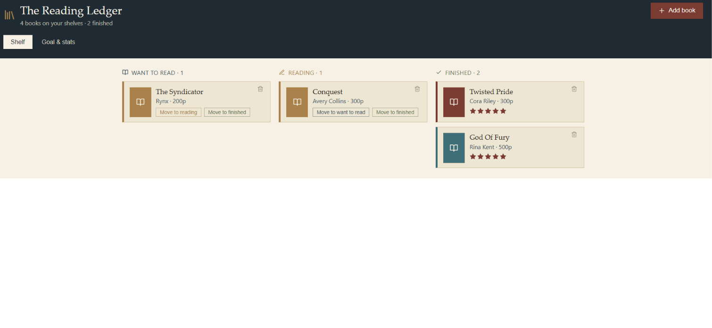

# 📚 The Reading Ledger — Book Tracker & Reading Goals

A React app for tracking what you're reading, building a to-read list, rating
finished books, and watching your progress toward an annual reading goal —
styled like a library card catalog instead of another generic dashboard.

**[Live demo →](#)** _(add your deployed link here)_



## Features

- 🔍 **Search Google Books** to add titles with cover art, author, and page
  count pulled automatically — or enter a book by hand
- 📖 **Three-column shelf** — Want to read / Reading / Finished — move books
  between them with one click
- ⭐ **Rate finished books** on a 5-star scale
- 🎯 **Annual reading goal** with a live progress bar and pace tracker
  ("3 books ahead of pace")
- 📊 **Stats dashboard** — books and pages read, average rating, a
  finished-per-month chart, and a genre breakdown
- 💾 Saves to your browser automatically (`localStorage`) — no login, no
  backend required

## Tech stack

- **React 18** (Vite)
- **Google Books API** for search
- **Recharts** for the monthly/genre charts
- **lucide-react** for icons

## Getting started

```bash
npm install
npm run dev
```

Then open the printed local URL. That's it — no API key or environment
variables needed for the Google Books search (it uses the public,
unauthenticated endpoint).

## Build & deploy

```bash
npm run build
```

This outputs a static `dist/` folder you can deploy anywhere (Vercel,
Netlify, GitHub Pages). For GitHub Pages, set `base` in `vite.config.js` to
match your repo name (see the comment in that file).

## Persisting data with Firebase instead of localStorage

By default the app saves your library to the browser's `localStorage`, so
data stays on one device/browser. To sync across devices with Firebase
Firestore instead:

1. Create a Firebase project and enable Firestore.
2. `npm install firebase`
3. Add your Firebase config and swap the `persist`/load logic in
   `src/App.jsx` (marked with a comment) for Firestore reads/writes, e.g.
   `setDoc(doc(db, "library", userId), { books, goal })`.

## Project structure

```
├── index.html
├── package.json
├── vite.config.js
└── src
    ├── main.jsx      # React entry point
    └── App.jsx       # All app logic and UI
```

## License

MIT — free to use, adapt, and build on.
